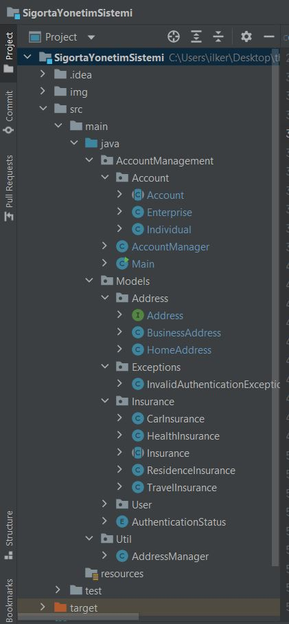
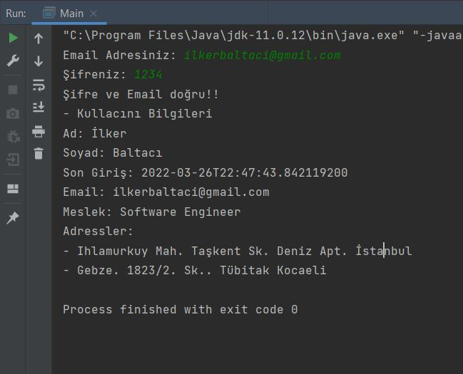

# Sigorta Yönetim Sistemi

Ödevde istenildiği gibi bir proje yapısı oluşturuldu. Proje başlarken 5 adet dummy data ekleniyor ve prgram onun üzerinden başlıyor.

</img>

---

Uygulama kullanıcıdan email ve şifre istiyor. Bu inputlar eşleşirse account objesi döndürülüyor ve kullanıcı bilgileri konsola yazıdırılıyor.

</img>